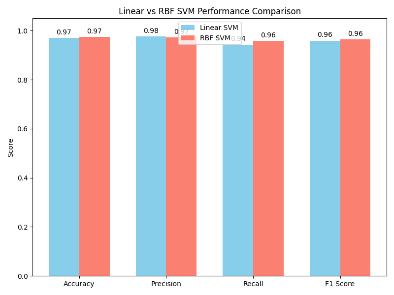
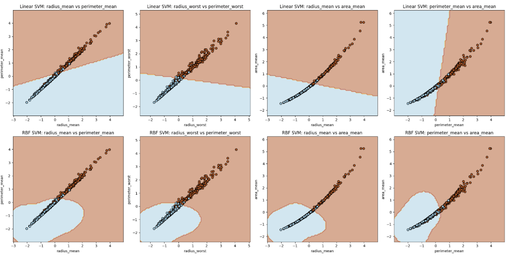
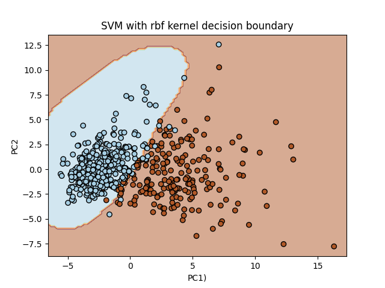
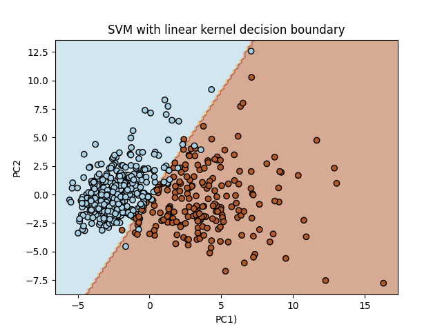
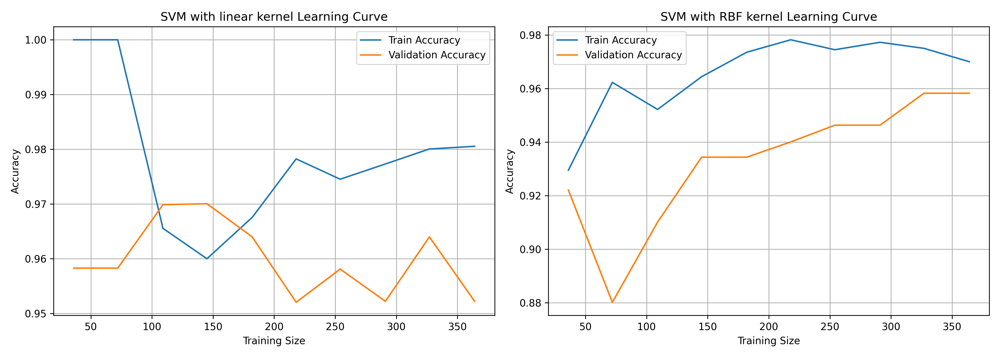

# Breast Cancer Classification using SVM

This project applies Support Vector Machine (SVM) classification to the Breast Cancer Wisconsin dataset to predict whether a tumor is malignant or benign. The goal is to maximize **recall**, which is critical in medical diagnoses to minimize false negatives.

## 🔍 Problem Statement

Early and accurate detection of breast cancer is vital. In this classification task, **recall** is the most important metric because failing to identify a malignant tumor can have serious consequences.

## ⚙️ Model & Parameters

Two SVM kernels were evaluated:

- **Linear Kernel**
- **RBF Kernel (Radial Basis Function)**

The best hyperparameters for the RBF kernel were found using grid search:
- **C = 10**
- **Gamma = 0.01**

These values were selected based on performance, particularly maximizing recall.

## 📊 Performance Comparison

| Metric     | Linear SVM | RBF SVM |
|------------|------------|---------|
| Accuracy   | 0.97       | 0.97    |
| Precision  | 0.98       | 0.97    |
| Recall     | 0.94       | **0.96** |
| F1 Score   | 0.96       | 0.96    |

As shown, the **RBF kernel** achieves higher **recall**, making it more suitable for this dataset.

## 🧠 Decision Boundaries

Visual comparison of the decision boundaries shows that the RBF kernel is more flexible and adapts better to the data distribution.

**RBF Kernel and Linear Kernel with different features as X and Y:**
Here I have taken those features X and Y which has high correlation.

**RBF Kernel (PCA 2 components):**

**Linear Kernel (PCA 2 components):**

## 📈 Learning Curves

Learning curves illustrate model generalization:

- The **linear kernel** shows slight overfitting.
- The **RBF kernel** generalizes better with increasing training data.

## ✅ Conclusion

- The **RBF kernel** outperforms the linear kernel in terms of **recall**, which is essential for medical diagnostics.
- It provides a better decision boundary and generalization capability.

## 📁 Files

- `performance.png`: Bar plot of evaluation metrics
- `rbf.png`: Decision boundary for RBF kernel
- `linear.png`: Decision boundary for linear kernel
- `learning_curves_1.png`: Learning curves for both kernels

---

Feel free to fork, clone, or contribute!

